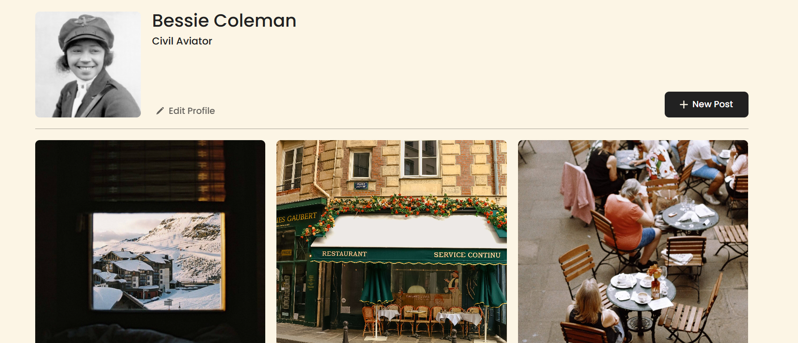
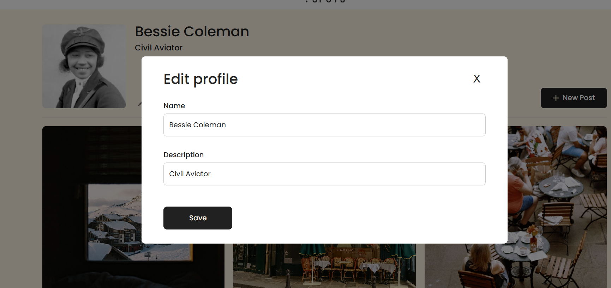
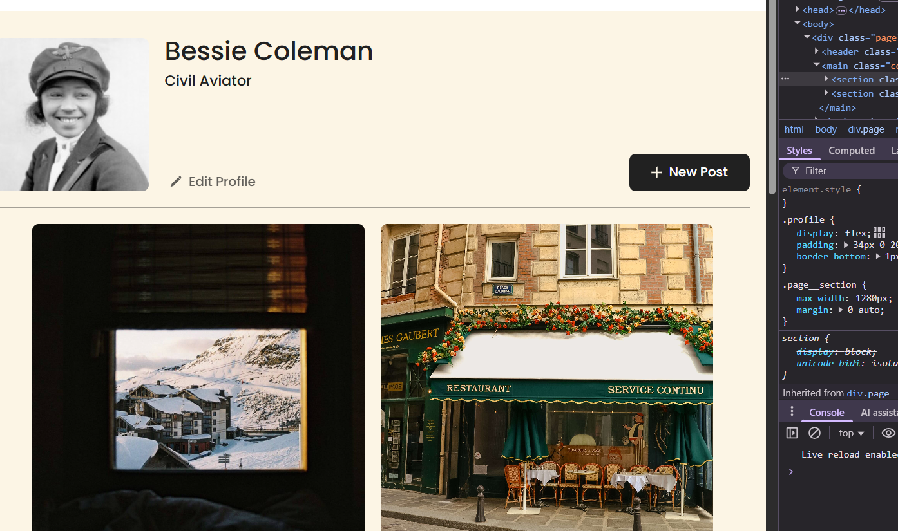

# Project 3: Spots

### Overview

- Intro
- Figma
- Images
- Technologies & Techniques
- Screenshots

**Intro**

This project is made so all the elements are displayed correctly on popular screen sizes. We recommend investing more time in completing this project, since it's more difficult than previous ones.

**Figma**

- [Link to the project on Figma](https://www.figma.com/file/BBNm2bC3lj8QQMHlnqRsga/Sprint-3-Project-%E2%80%94-Spots?type=design&node-id=2%3A60&mode=design&t=afgNFybdorZO6cQo-1)

**Images**

The way you'll do this at work is by exporting images directly from Figma — we recommend doing that to practice more. Don't forget to optimize them [here](https://tinypng.com/), so your project loads faster.

**Technologies & Techniques**

- **HTML**: Used for the structure of the website
- **CSS**: Styled the page and made it look nice
- **JavaScript**: Added interactivity like opening and closing modals
- **CSS Transitions**: Made the modals fade in and out smoothly
- **Responsive Design**: Made sure it works on different screen sizes

**Screenshots**

_Main page showing profile section and image cards_

_Edit profile modal with smooth transition effects_

_Responsive design on mobile devices_

## Project Pitch Video

Check out [this video](https://drive.google.com/file/d/1UFgzN5Xk16E5LK4FF8kNS0LVx61W4_2G/view?usp=sharing), where I describe my
project and some challenges I faced while building it.

**project link**
https://damarimorgado.github.io/se_project_spots/
